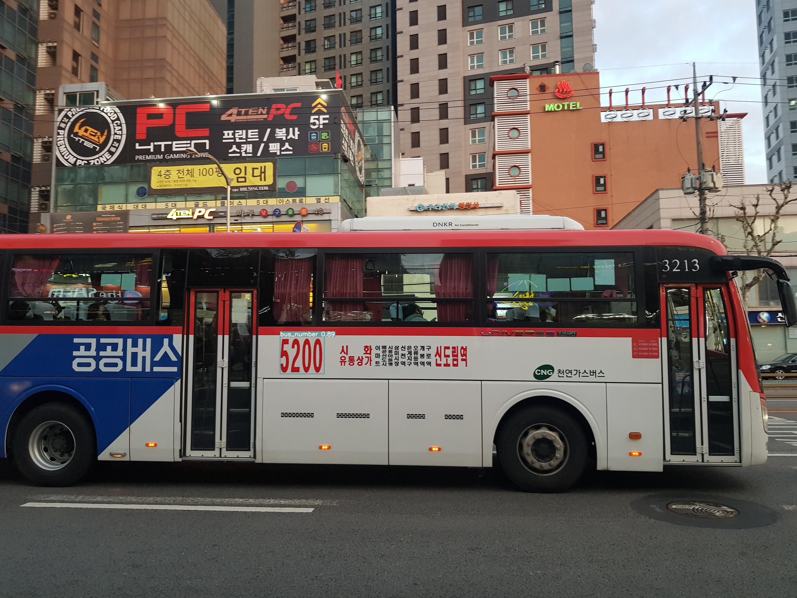
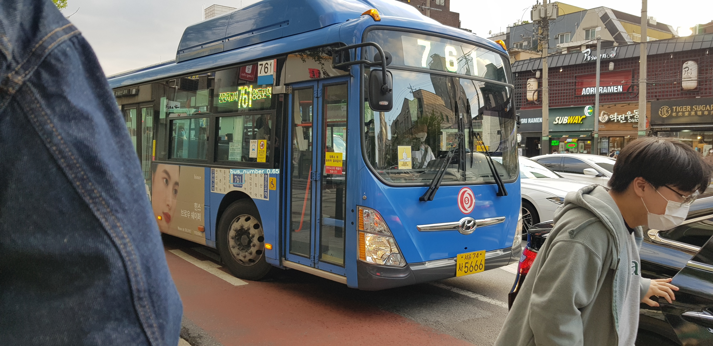

# AllEye

### how to run
--------------------------------------------------------
< > 로 씌워져 있는건 필요한 값을 넣으셔야해요<br>
<epochs> 는 train하고자 하는 epochs 수를 입력<br>
<result directory name> 은 train결과를 저장할 directory이름이에요<br>

```
  $ git clone https://github.com/kiteday/AllEye.git
  $ cd AllEye/yolov5
  
  $ pip3 install -r requirements.txt
  $ python3 train.py --epochs <epochs> --batch-size 1 --cfg ./model/yolov5s.yalm --data ./data/bus_data.yalm --name <result directory name> 
  
  $ python3 detect.py --weights ./runs/<best result dir>/weights/best.pt --source ./data/bus/bus-joono-video.mp4 
```

### result
----------------------------------------------



